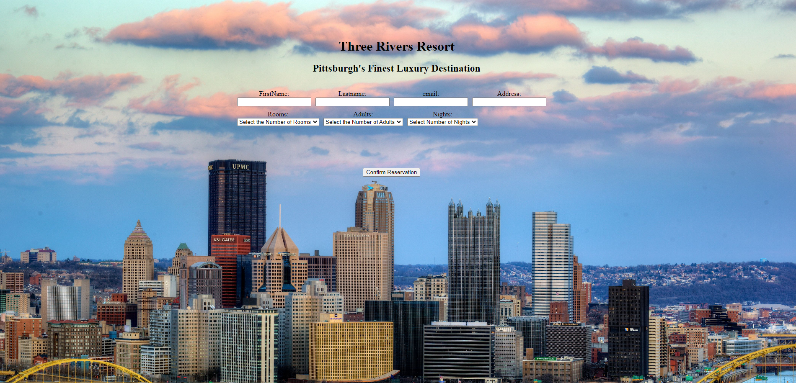

# Hotel Booking website

 

Hotel Booking site written in HTML and CSS

 

Visit website [here](https://saeed7865.github.io/Hotel-project/)

 

## Summary

This was an interesting project for me because learned how to actually use the flexbox option which is a great way to organize content. Its a hotel booking website with multiple forms. It took me about 2 weeks to work it all out but the process of figuring it out on my own was an invaluble experience.

## Author

-   **Osama Sandhu** - _Full-Stack Software Developer_ - [Website]| [LinkedIn]
